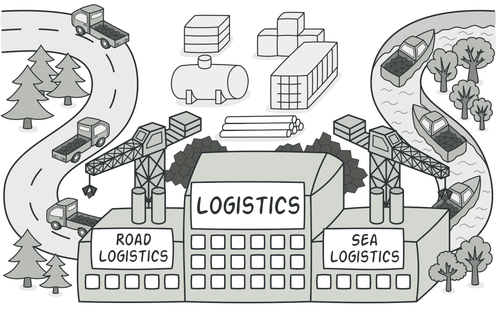
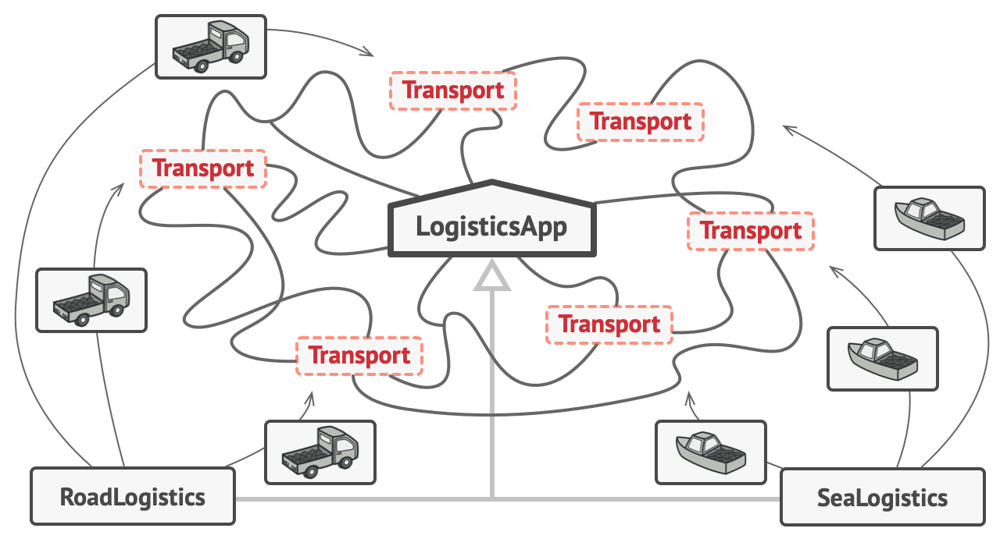

# Factory Method

### **Ý định**

**Factory Method** là một Creational Design Pattern cung cấp một interface để tạo các đối tượng trong lớp cha, nhưng cho phép các lớp con thay đổi loại đối tượng sẽ được tạo.



### Vấn đề <a href="problem" id="problem"></a>

Tưởng tượng bạn đang tạo một ứng dụng quản lý logistics. Phiên bản đầu tiên trong ứng dụng của bạn chỉ có thể xử lý việc vận chuyển bằng xe tải, vì vậy phần lớn code của bạn nằm trong lớp `Truck` (Xe tải).

Vào một ngày đẹp trời, bạn nhận được hàng chục yêu cầu từ các công ty vận tải đường biển kết hợp logistics vào ứng dụng của bạn.


Đây là một tin tốt, nhưng còn code thì sao? Hiện tại, phần lớn code của bạn đã kết nối với lớp `Truck`. Việc thêm lớp `Ship` (Tàu) vào thì sẽ phải thay đổi toàn bộ codebase. Hơn nữa, nếu sau này bạn muốn thêm một loại phương tiện mới vào ứng dụng, bạn phải thực hiện lại tất cả những thay đổi này.

Kết quả là code của bạn phụ thuộc hoàn toàn vào loại phương tiện vận chuyển.

### Giải pháp

Factory Method pattern gợi ý bạn thay vì gọi khởi tạo đối tượng một cách trực tiếp (sử dụng `new`), bạn sẽ gọi đến một _factory (nhà máy)_ đặc biệt. Đừng lo lắng: Các đối tượng vẫn được tạo qua toán tử `new`, nhưng nó đang gọi từ _factory_. Các đối tượng được trả trả về từ nhà máy được gọi là _products_ (sản phẩm).

.png>)

Thoạt nhìn, thay đổi này có vẻ vô nghĩa: chúng ta vừa chuyển cách khởi tạo từ phần này sang phần khác của chương trình. Tuy nhiên, hãy xem xét điều này: bây giờ bạn có thể override (ghi đè) phương thức của Factory trong một lớp con và thay đổi lớp sản phẩm.


Ví dụ, cả hai lớp `Truck` và `Ship` đều implement (bổ sung) từ interface `Transport`, interface này khai báo một phương thức (method) được gọi là `deliver` (giao hàng). Mỗi lớp thực hiện phương thức này khác nhau: xe tải chuyển hàng bằng đường bộ, tàu chuyển hàng bằng đường biển. Phương thức trong lớp `RoadLogistics` sẽ trả về những đối tượng xe tải (truck), trong khi phương thức trong lớp  sẽ trả về những đối tượng là tàu (ship).



### Cấu trúc


1. `Product` được khai báo là interface cho tất cả các đối tượng được tạo ra.
2. **Concrete Products **là các cách triển khai khác nhau của `Product` interface.
3.  **Creator** được khai báo là lớp `factory` để trả về các đối tượng sản phẩm mới. Điều quan trọng là loại trả về của phương thức này phải phù hợp với `Product` interface.

    Bạn có thể khai báo _factory_ là trừu tượng (abstract) để buộc tất cả các lớp con triển khai các phiên bản phương thức riêng của chúng. Thay vào đó, factory cơ sở có thể trả về một số loại sản phẩm mặc định.

    Lưu ý, việc tạo ra sản phẩm không phải là trách nhiệm chính của _Creator_. Thông thường lớp _Creator_ đã có sẵn những logic cốt lõi liên quan đến sản phẩm. Factory giúp tách logic này khỏi lớp _Concrete Products. _Đây là một ví dụ: một công ty phát triển phần mềm lớn có thể có một bộ phận đào tạo cho các lập trình viên. Tuy nhiên, chức năng chính của công ty nói chung vẫn là viết code, không đào tạo lập trình viên.
4. **Concrete Creators** ghi đè phương thức gốc của nhà máy để nó trả về một loại sản phẩm khác.

### Pseudocode <a href="pseudocode" id="pseudocode"></a>

This example illustrates how the **Factory Method** can be used for creating cross-platform UI elements without coupling the client code to concrete UI classes.

\


.png>)

The base dialog class uses different UI elements to render its window. Under various operating systems, these elements may look a little bit different, but they should still behave consistently. A button in Windows is still a button in Linux.

When the factory method comes into play, you don’t need to rewrite the logic of the dialog for each operating system. If we declare a factory method that produces buttons inside the base dialog class, we can later create a dialog subclass that returns Windows-styled buttons from the factory method. The subclass then inherits most of the dialog’s code from the base class, but, thanks to the factory method, can render Windows-looking buttons on the screen.

For this pattern to work, the base dialog class must work with abstract buttons: a base class or an interface that all concrete buttons follow. This way the dialog’s code remains functional, whichever type of buttons it works with.

Of course, you can apply this approach to other UI elements as well. However, with each new factory method you add to the dialog, you get closer to the [Abstract Factory](https://refactoring.guru/design-patterns/abstract-factory) pattern. Fear not, we’ll talk about this pattern later.

```java
// The creator class declares the factory method that must
// return an object of a product class. The creator's subclasses
// usually provide the implementation of this method.
class Dialog is
    // The creator may also provide some default implementation
    // of the factory method.
    abstract method createButton():Button

    // Note that, despite its name, the creator's primary
    // responsibility isn't creating products. It usually
    // contains some core business logic that relies on product
    // objects returned by the factory method. Subclasses can
    // indirectly change that business logic by overriding the
    // factory method and returning a different type of product
    // from it.
    method render() is
        // Call the factory method to create a product object.
        Button okButton = createButton()
        // Now use the product.
        okButton.onClick(closeDialog)
        okButton.render()


// Concrete creators override the factory method to change the
// resulting product's type.
class WindowsDialog extends Dialog is
    method createButton():Button is
        return new WindowsButton()

class WebDialog extends Dialog is
    method createButton():Button is
        return new HTMLButton()


// The product interface declares the operations that all
// concrete products must implement.
interface Button is
    method render()
    method onClick(f)

// Concrete products provide various implementations of the
// product interface.
class WindowsButton implements Button is
    method render(a, b) is
        // Render a button in Windows style.
    method onClick(f) is
        // Bind a native OS click event.

class HTMLButton implements Button is
    method render(a, b) is
        // Return an HTML representation of a button.
    method onClick(f) is
        // Bind a web browser click event.


class Application is
    field dialog: Dialog

    // The application picks a creator's type depending on the
    // current configuration or environment settings.
    method initialize() is
        config = readApplicationConfigFile()

        if (config.OS == "Windows") then
            dialog = new WindowsDialog()
        else if (config.OS == "Web") then
            dialog = new WebDialog()
        else
            throw new Exception("Error! Unknown operating system.")

    // The client code works with an instance of a concrete
    // creator, albeit through its base interface. As long as
    // the client keeps working with the creator via the base
    // interface, you can pass it any creator's subclass.
    method main() is
        this.initialize()
        dialog.render()
```

### Áp du <a href="applicability" id="applicability"></a>
