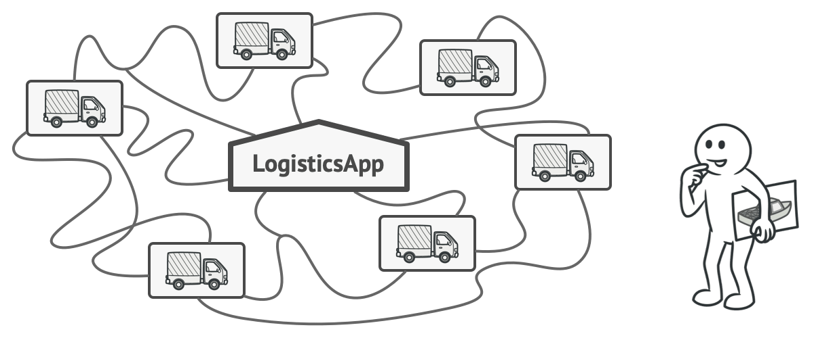

# Factory Method

### **Ý định**

**Factory Method** là một Creational Design Pattern cung cấp một interface để tạo các đối tượng trong lớp cha, nhưng cho phép các lớp con thay đổi loại đối tượng sẽ được tạo.

### Vấn đề 

Tưởng tượng bạn đang tạo một ứng dụng quản lý logistics. Phiên bản đầu tiên trong ứng dụng của bạn chỉ có thể xử lý việc vận chuyển bằng xe tải, vì vậy phần lớn code của bạn nằm trong lớp `Truck` (Xe tải).

Vào một ngày đẹp trời, bạn nhận được hàng chục yêu cầu từ các công ty vận tải đường biển kết hợp logistics vào ứng dụng của bạn

Đây là một tin tốt, nhưng còn code thì sao? Hiện tại, phần lớn code của bạn đã kết nối với lớp `Truck`. Việc thêm lớp `Ship` (Tàu) vào thì sẽ phải thay đổi toàn bộ codebase. Hơn nữa, nếu sau này bạn muốn thêm một loại phương tiện mới vào ứng dụng, bạn phải thực hiện lại tất cả những thay đổi này.

Kết quả là code của bạn phụ thuộc hoàn toàn vào loại phương tiện vận chuyển.

### Giải pháp

Factory Method pattern gợi ý bạn thay vì gọi khởi tạo đối tượng một cách trực tiếp (sử dụng `new`), bạn sẽ gọi đến một _factory (nhà máy)_ đặc biệt. Đừng lo lắng: Các đối tượng vẫn được tạo qua toán tử `new`, nhưng nó đang gọi từ _factory_. Các đối tượng được trả trả về từ nhà máy được gọi là _products_ (sản phẩm).

.png>)

Thoạt nhìn, thay đổi này có vẻ vô nghĩa: chúng ta vừa chuyển cách khởi tạo từ phần này sang phần khác của chương trình. Tuy nhiên, hãy xem xét điều này: bây giờ bạn có thể override (ghi đè) phương thức của Factory trong một lớp con và thay đổi lớp sản ph

Ví dụ, cả hai lớp `Truck` và `Ship` đều implement (bổ sung) từ interface `Transport`, interface này khai báo một phương thức (method) được gọi là `deliver` (giao hàng). Mỗi lớp thực hiện phương thức này khác nhau: xe tải chuyển hàng bằng đường bộ, tàu chuyển hàng bằng đường biển. Phương thức trong lớp `RoadLogistics` sẽ trả về những đối tượng xe tải (truck), trong khi phương thức trong lớp  sẽ trả về những đối tượng là tàu (ship)

### Cấu trúc

1. `Product` được khai báo là interface cho tất cả các đối tượng được tạo ra.
2. **Concrete Products **là các cách triển khai khác nhau của `Product` interface
3.  **Creator** được khai báo là lớp `factory` để trả về các đối tượng sản phẩm mới. Điều quan trọng là loại trả về của phương thức này phải phù hợp với `Product` interface.

    Bạn có thể khai báo _factory_ là trừu tượng (abstract) để buộc tất cả các lớp con triển khai các phiên bản phương thức riêng của chúng. Thay vào đó, factory cơ sở có thể trả về một số loại sản phẩm mặc định.

    Lưu ý, việc tạo ra sản phẩm không phải là trách nhiệm chính của _Creator_. Thông thường lớp _Creator_ đã có sẵn những logic cốt lõi liên quan đến sản phẩm. Factory giúp tách logic này khỏi lớp _Concrete Products. _Đây là một ví dụ: một công ty phát triển phần mềm lớn có thể có một bộ phận đào tạo cho các lập trình viên. Tuy nhiên, chức năng chính của công ty nói chung vẫn là viết code, không đào tạo lập trình viên.
4. **Concrete Creators** ghi đè phương thức gốc của nhà máy để nó trả về một loại sản phẩm khác.
